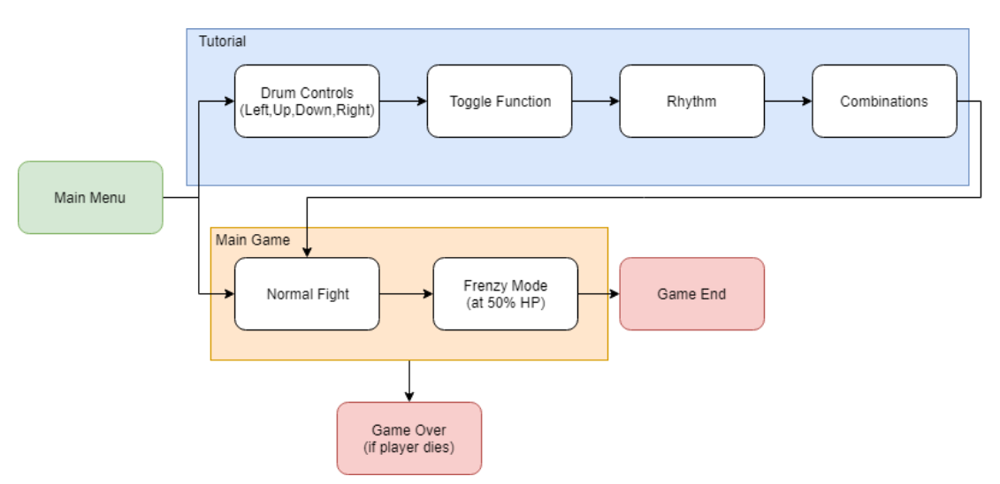
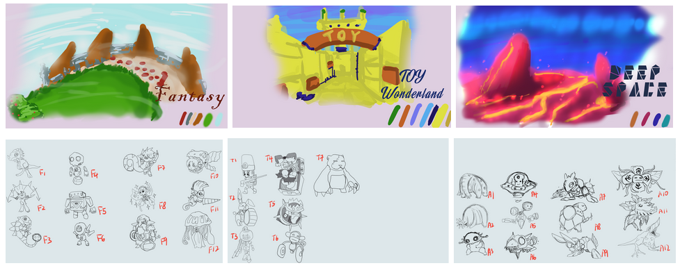
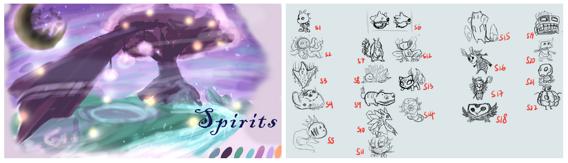
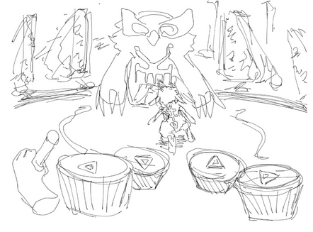
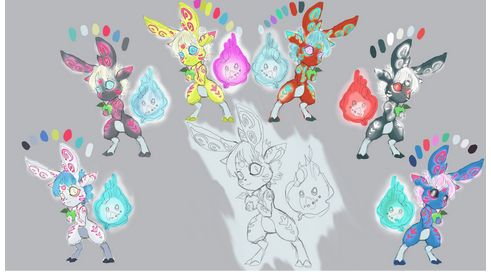
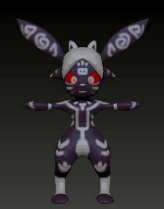
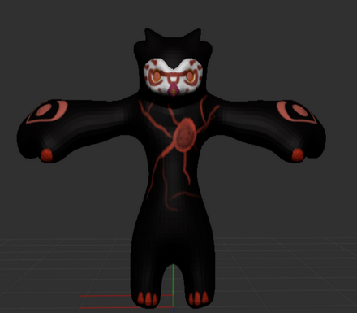
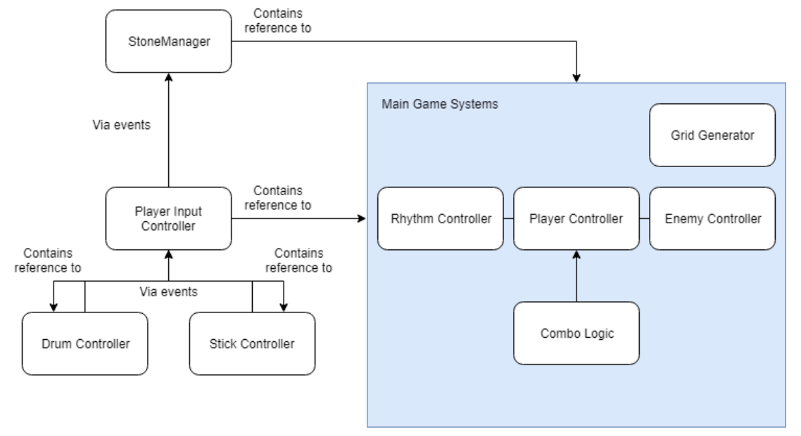

# Ra-beat
A VR rythm game made in unity. Was featured at the [NUS 13th-Steps](http://isteps.comp.nus.edu.sg/event/13th-steps/module/CS4350/project/4) event. Check out more of the game at the [Ra-beat facebook page](https://m.facebook.com/rabeatVR/).

Genre: VR Rhythm Game  

 
*Ra-beat promotional poster*

 

## **Overview**

### **Game Flow and Progression of Play**

The game has two levels, the (optional) tutorial level and the main game itself. The main menu gives the option to access either the tutorial or the main game directly.
The tutorial is split into several parts to better pace the player through the controls
Drum Controls: The player has to hit all four directions before proceeding
 

- Toggle: The player has to toggle the drums before proceeding
- Rhyth: The player now has to hit all four attack drums in beat before proceeding
- Combination: The player has to complete a combination before proceeding
- Free Time: The player can play around until the target dummy’s HP runs out

The game then proceeds to the main gameplay. The main gameplay consists of one level, though the gameplay itself is split into 2 stages. When the boss’s health drops below 50%, the frequency of the attacks and the movement of the boss increases.

 

### **Unique Game Elements**
Serious Fun  
Being a rhythmic game, Ra-Beat gives players the feeling of learning an instrument. Through playing the game, it trains players to be better at keeping to the beats. Players are also required to react quickly and be strategic with his decisions. This improves players’ reaction time and ability to react to different situations quickly.

Hard Fun  
Multi-tasking between keeping in the beat, avoiding boss attacks and performing combo attacks takes skills and practice to do well. To defeat the boss, players will have to strategise and a huge sense of satisfaction will be felt when they master the game and overcome the challenges.

 

### **Story**
You are thrown into a magical world where everything is controlled by the God of Metronome. Ra - a mythical rabbit, becomes your partner. However, Ra only understands your commands through drum beats and only when they follow the beats. You are now on a journey to find your way back home, There is just one rule to survive in this world: Follow the beats, not the rhythm!

 

### **Objective**
Defeat the boss while keeping to the beat.

 

### **Level Description**
The level is designed with a grid to register movement and attacks as it is more intuitive to register a single action with a single drumbeat. The feedback that is produced with every successful drumbeat will be more prominent and will serve as an obvious response to the players.
The grid size is chosen to be 9 by 5 with the consideration of game balance where the player is given enough space to manoeuvre the level and at the same time, be under constant pressure from the enemies attack. 
Pillars are also used in the level to represent the health of the player, the enemy and the various combos that are available. As this is a VR game, the use of User Interface (UI) is not recommended as it is hard for players to see it. We wanted to introduce the UI in the environment that fits the theme of the game. The pillars with combo are given as well to guide players as it may be hard for players to remember all the combos in such a short period of time.

 

### **Game Mechanics and Dynamics**
Mechanics: Hitting the drums on the beat to control your familiar’s movements and attacks. The more you hit on the beat, the greater the damage your familiar will do. 

Dynamics: Hitting various attacks combinations will dish out different combo moves which are much more powerful than standard basic attacks. Each combo moves has its own specific range, hence players can execute the various combo strategically at different locations while evading the boss attack pattern.

 

### **Concept Art**
Alternative theme exploration  

 

Final chosen theme  

 

Initial screen mockup  

 

Color Pallet Exploration  

 

### **3D Models**
Main Character - Ra  

 

Boss - Bearowl  

 

## **Technical Design Document**
### **General Structure**
 

The general code structure is as such. The player controls (Drums/Stick) is separated out from the main gameplay logic so that it can be reused in other scenes (such as Main Menu and Tutorial). The main game system is separated into components which have knowledge of each other for fast execution and efficiency purposes, whereas StoneMangager (which controls the UI in-game) has to have a reference to the values within the main game system.

One optimization we made is to avoid usage of the Update method when it comes to waiting for player input. Instead of checking every frame, we use events and listeners to reduce unnecessary computational load and coupling. However, there is a limit to this as the event system in Unity cannot pass values which are required in certain parts of the system.

 

The AI is scripted with a state machine to decide on its actions at different point of the game. The states are coded in abstraction to perform a list of actions and decisions which may lead to the transition of a new state depending on the outcome of the decision. The exit state will then be executed before the state changes. This allows control over the AI behaviour at different states as all the components are customizable. This means that creation of states will be easier in the future.

Furthermore, the state controller that controls the enemy has access to the enemy skill decider that will provide different skills on request. This allows the different components of the state to get access to the skills so that different skills may be performed directly from the script of the components.

### **Challenges Faced**
Aesthetics  
Synching the animations to the beat and music is a challenge as the timings have to be precise in order to deliver a convincing rhythm game experience. Besides that, finding the correct animations from mixamo to fit the models created poses some problems as the limitations of the auto-rigging in mixamo meant that the models made needs to follow a bipedal built with no extreme features. This result in a more limited creative freedom. In addition, any extra physical features that the model has such as the large arms and the lack of a thin neck for the boss means that manual touch up of the skinning of the rig on the model has to be made for the animations to look correct.

### **Music**
Being a rhythmic game, it is highly dependent on the music. Several challenges faced were coming up with a track that fits the game and finding the appropriate BPM (Beats Per Minute) for the game. Rather than creating an EDM music, we wanted to create a music that can bring about fantasy feeling yet keeping the beats obvious to the players. A total of 3 iterations of music tracks were composed before deciding on the track with a boss fight feeling in a fantasy world. The background constant percussion of music beats was also added and increased in volume to make it easier for players to recognise the beats. 120 BPM (0.5 seconds per beat) was chosen as it is within human reaction time and gives a good pace to the game.

 

## **Playing the game**
Run the `RythmTest.exe` file in the `RhythmTest/Build` folder.   
Requires a VR headset as a prerequisite. 